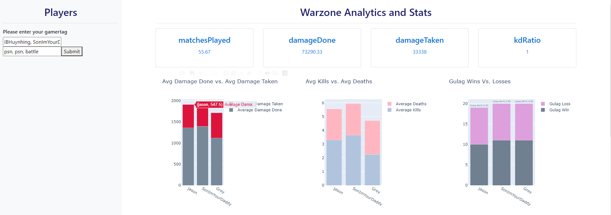
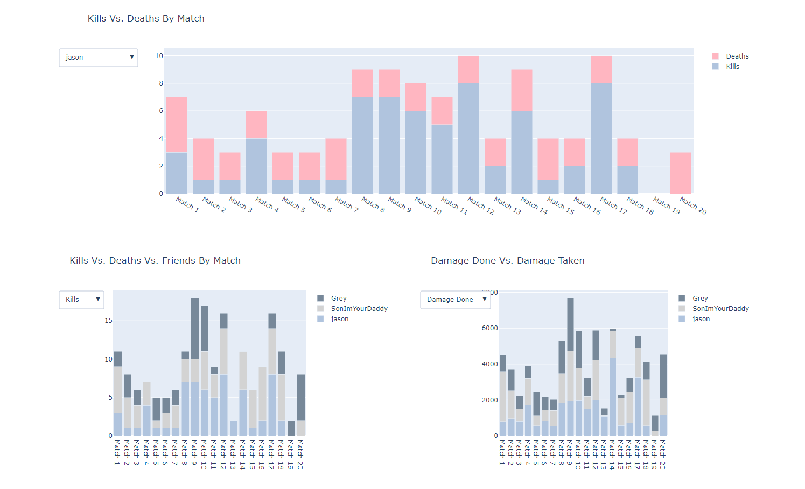
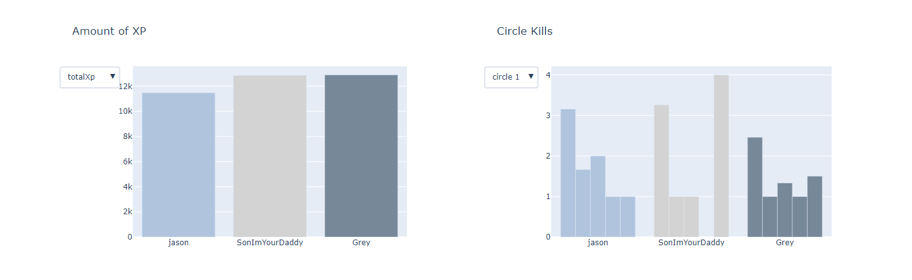

# Warzone Stat Tracker
- https://warzoneanalytics.herokuapp.com/
- Created a dashboard that allows you to compare your stats in Call of Duty Warzone matches against your friends or even professional Call of Duty players!
- The statistics shown are from the previous 20 games of the user submitted
- To see your stats, simply enter your gamertag, followed by your platform played on (psn, steam, xbl, battle, uno (activision ID), acti (activision tag)
- Replace "#" with "%23" e.g. Grey#1858 -> Grey%231858
- In order to see your stats, you will need to ensure your account is **PUBLIC** on Activision.

## Code and Resources Used
- Python version 3.7
	- Packages: Pandas, NumPy, Plotly, requests, etc
- Dash
- HTML/CSS
- Heroku

## Statistics Shown
- Avg Damage Done Vs. Avg Damage Taken
- Avg Kills Vs. Avg Deaths
- Gulag Wins Vs. Gulag Losses
- Kills Vs Deaths by Matches
- Kills Vs. Deaths by Friends By Match
- Damage Done Vs. Damage Taken
- Total XP 
- Warzone Circle kills

## Visuals

